<div align="center">

# 🗺️ BizMap

### 매장/시설을 지도 위에서 관리하고, 한 줄 스크립트로 외부 사이트에 임베드하는 **B2B 위치 관리 플랫폼**

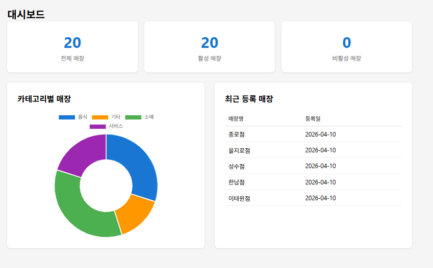

</div>

---

## 1. 프로젝트 소개

BizMap은 기업이 자사 매장/시설을 지도 위에서 등록·조회·관리하고, 고객사 또는 자사 외부 사이트에 **매장 찾기 위젯을 한 줄의 스크립트로 임베드**할 수 있는 B2B 위치 관리 플랫폼입니다.

핵심 가치는 다음 세 가지입니다:

- **멀티테넌트 데이터 격리** — 회사별로 매장 데이터가 분리되어 타사 데이터 접근 불가
- **Google Maps Platform 풀스택 활용** — Maps JS / Places (New) / Geocoding 직접 연동
- **임베드 위젯** — 외부 도메인에서 한 줄로 사용 가능한 위치 위젯

---

## 2. 기술 스택

### Backend


### Frontend


### Google Maps Platform

-4285F4?logo=googlemaps&logoColor=white)


### Infra


---

## 3. 주요 기능

> 스크린샷 자리: 각 기능별 캡처 이미지를 추후 `docs/screenshots/` 에 추가

### 3-1. 매장 관리 (B2B 멀티테넌트)

- `company_id` 외래키 기반 데이터 격리. JWT payload 의 `companyId` 를 `SecurityContextHolder` → `SecurityUtils.getCurrentCompanyId()` 로 추출
- 모든 Store Service 메서드에서 **company_id 일치 검증** 필수, 불일치 시 `FORBIDDEN (403)` 반환
- CRUD + 카테고리 필터 + 키워드 검색 + 페이징

<div align="center">
  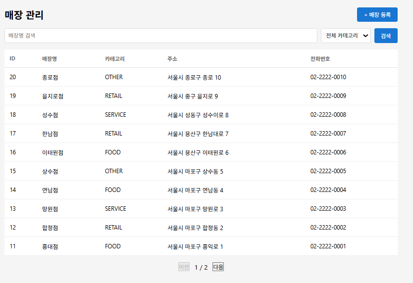
  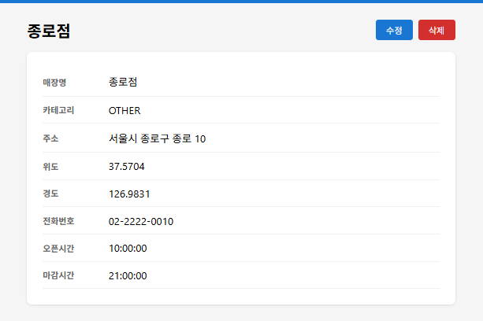
  <p><em>좌: 매장 목록 + 카테고리 필터 · 우: 매장 상세 정보</em></p>
</div>

### 3-2. Google Places Autocomplete

- 매장 등록 시 주소 텍스트 입력 → **자동완성 드롭다운**으로 후보 표시 → 클릭 시 좌표 자동 세팅
- **AutocompleteSuggestion API (2025년 신규 API)** 적용 — 기존 `AutocompleteService` deprecated 대응
- **세션 토큰 (`AutocompleteSessionToken`)** 으로 비용 최적화: Autocomplete 요청 N회 + Place Details 1회를 단일 세션으로 과금
- **300ms 디바운싱** 으로 키 입력마다 API 호출하는 낭비 제거
- 한국 주소만 노출 (`region: 'kr'`, `language: 'ko'`)

### 3-3. PostGIS 공간 쿼리

- `ST_DWithin(geography, geography, radius_meters)` 으로 반경 내 매장 필터
- `ST_Distance(geography, geography)` 로 거리 계산 후 가까운 순 정렬
- WGS84 타원체 측지선 기반이라 Haversine 구면 근사보다 **정확도 향상**
- GiST 공간 인덱스 활용 가능 → 매장 수 증가 시 후보군 사전 필터링으로 성능 확보
- Native query + Hibernate Spatial 의존성

<div align="center">
  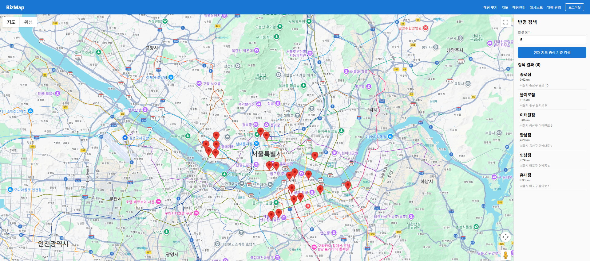
  <p><em>지정한 반경 내 매장만 거리순으로 정렬되어 지도에 표시</em></p>
</div>

### 3-4. 재고 기반 매장 찾기

- 상품 → 사이즈 선택 → **재고 1개 이상인 매장만 필터**
- 브라우저 `geolocation` 으로 사용자 현재 위치 획득 → **거리순 정렬**
- 매장 클릭 → 경로 안내 패널 → "자동차/도보 길찾기" 버튼 → **Google Maps 딥링크**로 새 탭 오픈
- 반경 입력 500ms 디바운스 적용

<div align="center">
  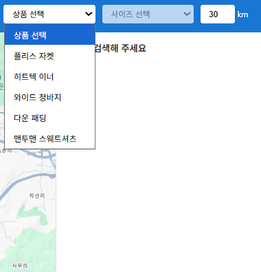
  <p><em>① 상품과 사이즈 선택 → 재고 보유 매장만 추려냄</em></p>
  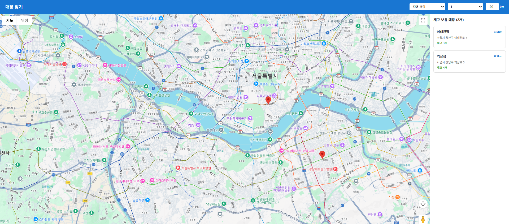
  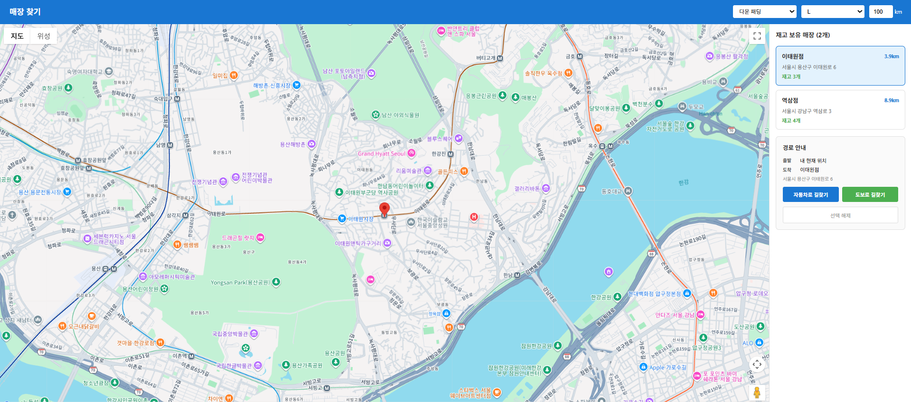
  <p><em>② 거리순 정렬 결과 + 매장 핀 표시</em></p>
  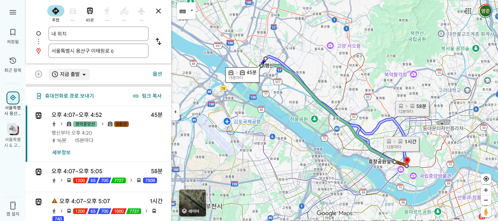
  <p><em>③ 매장 선택 → Google Maps 딥링크로 자동차/도보 길찾기 연결</em></p>
</div>

### 3-5. 매장 찾기 위젯 (핵심 차별점)

- **API 키 발급 시스템** — 회사별로 위젯 키 생성/조회/삭제 (`/api/widget-keys`), `allowedOrigin` 으로 도메인 제한 가능
- 고객사 웹사이트는 **단 두 줄**로 임베드 가능:
  ```html
  <script src="https://bizmap.example.com/widget/bizmap-widget.js?key=YOUR_KEY"></script>
  <div id="bizmap-widget" style="width:100%;height:400px;"></div>
  ```
- 백엔드가 **위젯 JS 를 동적으로 생성**해서 응답 (`@GetMapping("/widget/bizmap-widget.js")`) — 위젯 키와 Google Maps API 키를 서버 사이드에서 인라인 주입
- 위젯 JS 는 **Google Maps 스크립트를 동적 로드** 후 매장 핀 + InfoWindow 렌더링, 로드 실패 시 텍스트 fallback
- **전역 callback 큐** (`__bizmapMapsCallbacks`) 로 한 페이지에 위젯 여러 개 임베드해도 Google Maps 스크립트는 한 번만 로드
- 외부 도메인 CORS 별도 정책 (`/widget/**` 와일드카드 origin)

<div align="center">
  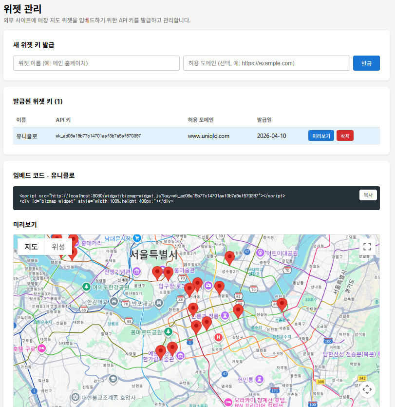
  <p><em>위젯 관리 페이지 — 회사별 API 키 발급/삭제 + 허용 도메인 설정</em></p>
  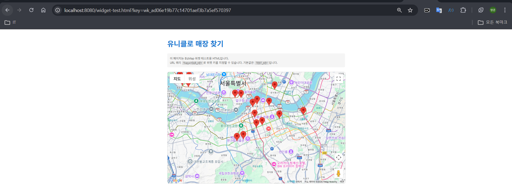
  <p><em>발급받은 키 한 줄로 외부 사이트에 매장 찾기 위젯 임베드</em></p>
</div>

### 3-6. JWT 인증

- **Access Token 30분 / Refresh Token 7일**
- `JwtAuthFilter (OncePerRequestFilter)` 가 모든 요청에서 `Authorization: Bearer` 추출 → 인증 객체 설정
- 프론트 Axios 응답 인터셉터에서 401 수신 시 `/api/auth/refresh` 자동 호출 → 새 Access Token 으로 원래 요청 재시도
- Refresh Token 은 `refresh_tokens` 테이블에 저장 (rotation 가능 구조)
- 비밀번호는 BCrypt (strength 10) 해시 저장

---

## 4. 아키텍처

### 4-1. 시스템 구성도

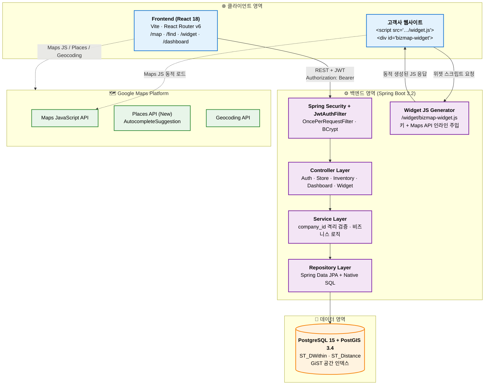

### 4-2. 인증 플로우 (JWT + Refresh)

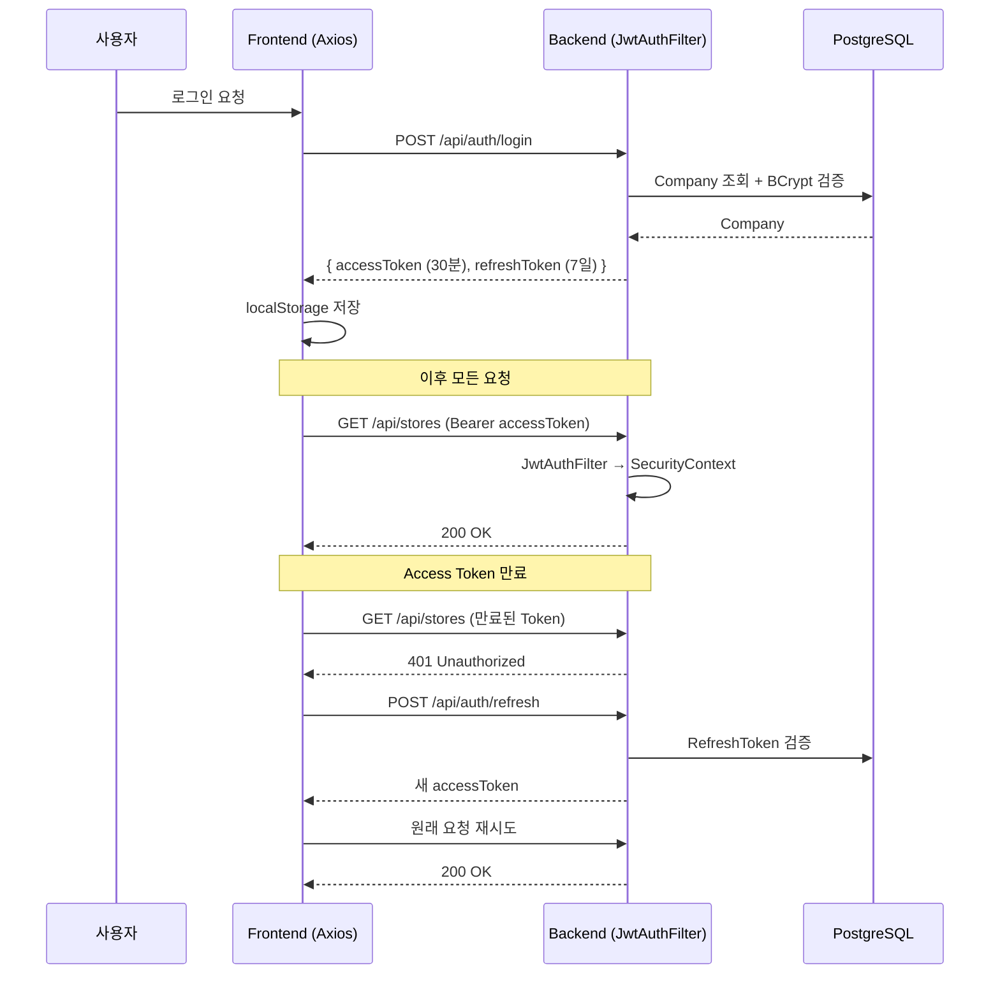

### 4-3. 위젯 임베드 플로우

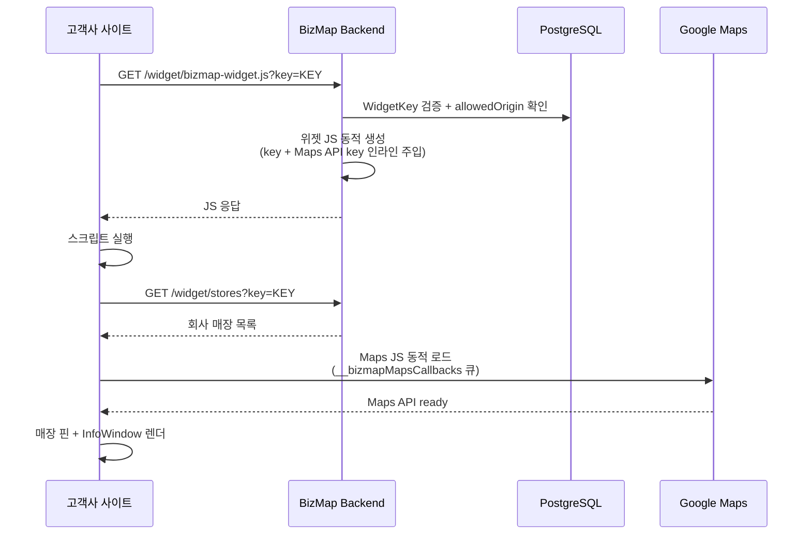

- **Frontend (React)** ↔ **Backend (Spring Boot)** — REST + JWT
- **Backend** ↔ **PostgreSQL + PostGIS** — JPA (CRUD) + Native SQL (공간 쿼리)
- **Frontend** + **Backend** ↔ **Google Maps Platform** — Maps JS / Places / Geocoding
- **Backend** → **Widget JS 동적 생성** → **고객사 웹사이트** 임베드

---

## 5. Google Maps Platform API 활용

Google Maps Platform 을 직접 연동

| API | 활용 내용 |
|-----|-----------|
| **Maps JavaScript API** | 매장 지도 시각화, 마커 + InfoWindow, 위젯 동적 로드 (`maps.googleapis.com/maps/api/js?...&libraries=marker&callback=...`), 마커 클릭 이벤트 |
| **Places API (New)** | 주소 자동완성 (`AutocompleteSuggestion.fetchAutocompleteSuggestions`), Place 상세 (`new Place({id}).fetchFields(['formattedAddress','location'])`), **세션 토큰 비용 최적화**, 한국 주소 제한 (`region: 'kr'`) |
| **Geocoding API** | 매장 등록 시 주소 ↔ 좌표 변환 (Autocomplete 도입 전 기본 흐름) |

### 비용/UX 최적화 노하우

- **세션 토큰**: Autocomplete N회 + Place Details 1회를 단일 세션으로 묶어 과금 최소화
- **300ms 디바운싱**: 키 입력마다 API 호출 → 사용자가 입력을 멈춘 후에만 호출
- **`region` / `language` 파라미터**: 불필요한 글로벌 결과 제외, 한국 주소만 노출
- **위젯 Maps 스크립트 단일 로드**: 같은 페이지에 위젯이 여러 개 있어도 `__bizmapMapsLoading` 가드로 Google Maps JS 는 한 번만 로드

---

## 6. 트러블슈팅 하이라이트

전체 14 + 1 건의 트러블슈팅 기록은 [TROUBLESHOOTING.md](./TROUBLESHOOTING.md) 에 정리되어 있습니다. 임팩트 있는 3건 요약:

### 6-1. Places API deprecated 대응 (`AutocompleteService` → `AutocompleteSuggestion`)
2025년 3월부터 Google 이 신규 GCP 프로젝트에서 기존 `google.maps.places.AutocompleteService` 를 비활성화. 콜백 패턴의 기존 코드를 **Promise 기반 신규 API** 로 마이그레이션. 동시에 필드명/옵션 차이도 정리:

| 항목 | 기존 (deprecated) | 신규 |
|------|------------------|------|
| 자동완성 | `AutocompleteService.getPlacePredictions()` (콜백) | `AutocompleteSuggestion.fetchAutocompleteSuggestions()` (Promise) |
| 상세 | `PlacesService.getDetails()` | `new Place({id}).fetchFields()` |
| 국가 제한 | `componentRestrictions: { country: 'kr' }` | `region: 'kr'` |
| 필드명 | `formatted_address`, `geometry` | `formattedAddress`, `location` |
| 세션 토큰 | 명시적 생성/폐기 | API 내부 관리 |

### 6-2. Routes API 정책 변경 대응 — 딥링크 방식으로 전환
경로 안내를 위해 Routes API v2 REST + Maps JS DirectionsService 를 차례로 시도했으나 **신규 GCP 프로젝트의 정책 변경**으로 빈 응답 / `ZERO_RESULTS` 반환 (4차 시도까지 모두 실패). API 의존성을 제거하고 **Google Maps 딥링크** 로 전환:
```
https://www.google.com/maps/dir/?api=1&destination={address}&travelmode=driving
```
- `origin` 을 생략해 구글맵이 사용자의 현재 위치를 자동 사용
- API 호출 0건 → 비용 0 + 정책 변경에 영향 없음
- 카카오맵, 네이버맵 등 실서비스에서 검증된 패턴

### 6-3. PostGIS `::geography` 캐스팅 문법 오류
Native query 에서 PostgreSQL 표준 `::geography` 캐스팅 사용 시 500 에러 발생. **Spring Data JPA 의 네이티브 쿼리 파서가 `:` 를 named parameter 접두사로 인식**하기 때문에 `::geography` 의 두 번째 `:` 가 `geography` 라는 바인딩 파라미터로 오해석됨:
```sql
-- Before (실패)
ST_MakePoint(s.longitude, s.latitude)::geography

-- After (ANSI SQL CAST)
CAST(ST_MakePoint(s.longitude, s.latitude) AS geography)
```
ANSI 표준 `CAST(... AS ...)` 로 교체하면 `:` 를 포함하지 않아 우회 가능.

---

## 7. 로컬 실행 방법

### 1) PostgreSQL + PostGIS 기동
```bash
docker-compose up -d
```
- 컨테이너: `postgis/postgis:15-3.4`
- 포트: `5433` (로컬 PostgreSQL 과 충돌 방지)

### 2) Backend 실행
```bash
cd backend
./gradlew bootRun
```
- 서버: http://localhost:8080
- 환경 변수 필요: `GOOGLE_MAPS_API_KEY` (위젯 JS 가 사용)

### 3) Frontend 실행
```bash
cd frontend
npm install
npm run dev
```
- 클라이언트: http://localhost:5173

### 4) 환경 변수
`frontend/.env`:
```
VITE_API_URL=http://localhost:8080/api
VITE_GOOGLE_MAPS_KEY=your_google_maps_key
```

### 5) 테스트 계정 (시드 데이터)
| 회사 | 이메일 | 비밀번호 |
|------|--------|----------|
| 유니클로 | uniqlo@bizmap.com | password123 |

시드 데이터: 매장 20개, 상품 5종 × 사이즈 4종, 매장별 재고 데이터 포함.

---

## 8. 개발 과정

본 프로젝트는 **Claude Code 멀티에이전트 워크플로우**를 활용하여 설계/구현되었습니다.

### 계층형 CLAUDE.md 구조
- 루트 [`CLAUDE.md`](./CLAUDE.md): 비즈니스 규칙, API 컨벤션, 에러 코드, Agent 위임 기준
- [`backend/CLAUDE.md`](./backend/CLAUDE.md): 백엔드 레이어 규칙 (Controller → Service → Repository), 보안 규칙, 도메인별 위임
- [`backend/src/main/java/com/bizmap/{auth,store,inventory,widget}/CLAUDE.md`](./backend): 도메인별 작업 범위와 엔드포인트 명세
- [`frontend/CLAUDE.md`](./frontend/CLAUDE.md): 프론트엔드 기술 스택, 라우팅, Axios 인터셉터 규칙, 커스텀 훅 목록

### Skills, Hooks 활용
- **Skills**: 코드 simplify, schedule, claude-api 등 재사용 가능한 작업 단위
- **Hooks**: 코드 작성/수정 시점에 자동으로 트리거되는 품질 검증 훅
- **TodoWrite / Plan mode**: 작업 단위 분해와 사전 설계 검증

### 결과
14 + 1 건의 트러블슈팅 기록 ([TROUBLESHOOTING.md](./TROUBLESHOOTING.md)) 과 7개 Phase 의 단계별 진행 기록 ([PROGRESS.md](./PROGRESS.md)) 으로 의사결정 과정과 실패 사례까지 모두 추적 가능합니다.

---

이 프로젝트는 Claude Code 를 활용하여 설계/구현되었습니다.
